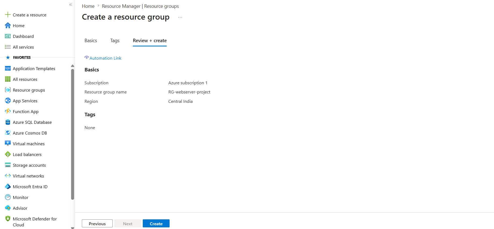
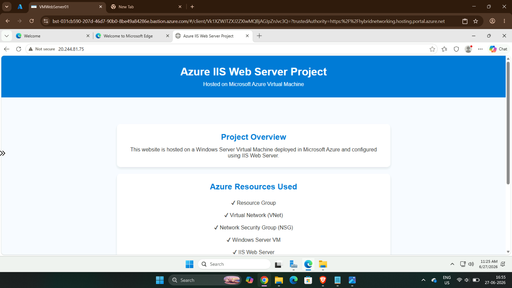

# Azure Web Server IIS Project

## Project Objective

Deploy a Windows Server VM in Azure, install IIS, and host a custom HTML website.

## Step 1 - Resource Group

.png)

## Step 2 - Virtual Network

.png)
.png)
.png)
.png)
## Step 3 - Network Security Group

.png)
.png)
.png)
.png)
.png)
.png)
.png)
.png)
.png)

## Step 4 - Virtual Machine

.png)
.png)
.png)
.png)
.png)
.png)
.png)
.png)
.png)

## Step 5 - Azure Bastion Connection

.png)
.png)
.png)

## Step 6 - IIS Installation

.png)
.png) 
.png) 
.png)
.png)
.png)

## Step 7 - Custom HTML Deployment

.png)
.png)
.png)
.png)
.png)

## Step 8 - Final Website

## step 9 -DNS
.png)
.png)
.png)

## Conclusion

Successfully deployed a Windows Server VM on Microsoft Azure, configured networking resources, installed IIS Web Server, and hosted a custom HTML website.

